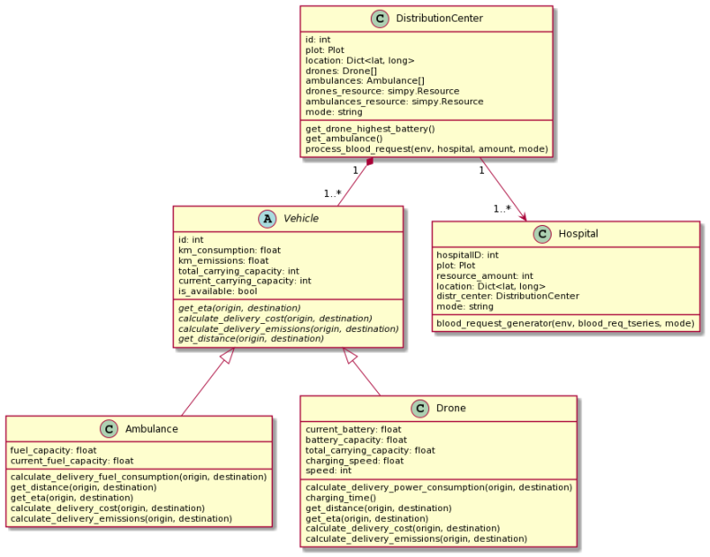

# Drone Blood Delivery Simulator

This is a discrete-event simulator for blood delivery using drones and ambulances
created as a part of Model-based Systems Engineering course at Technical University
of Denmark.

## Features
* Simulating blood delivery with given number of drones or ambulances
* Graphing blood requests and deliveries in time
* Calculating and graphing distance travelled, consumption (fuel or electric power),
cost, emissions

## Get Started
Edit the `main()` function in the `main.py` to run selected test cases and produce
required figures. Example scenario as well as comments on how to edit it are in the
file.

## Class Diagram
